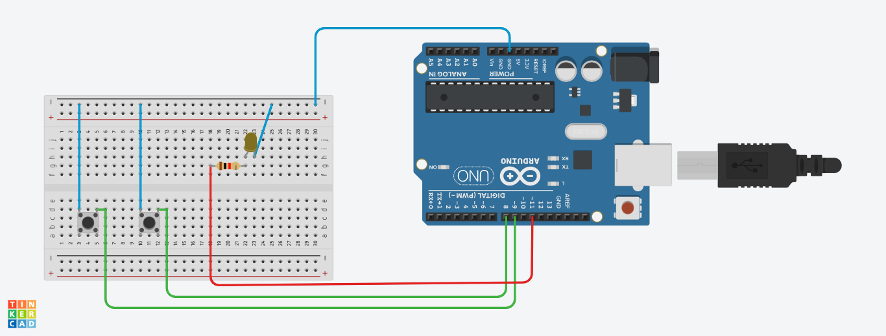
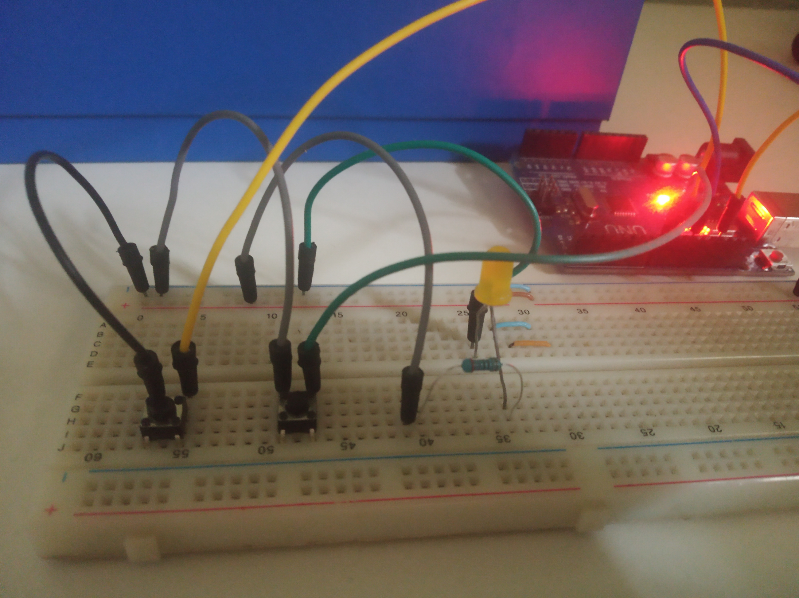
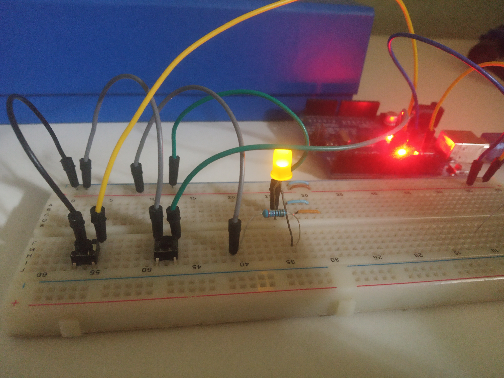

# Increment and Decrement Counter with Buttons

In this project, I will show how we can increment and decrement a counter using buttons on the Arduino Uno.

## Required Items
* Arduino Uno
* Protoboard
* Jumpers
* Push Buttons
* LED and resistors (If you want to mark the stop of the counter)

## Operation

The project aims to use the buttons to increment and decrement a counter up to a pre-configured limit. Optionally, an LED can be placed to indicate that the counter has reached the limit.

As can be seen in the code, the counter has a lower limit of zero and an upper limit of the "limit" variable that can be adjusted to whatever the user wishes.

## How to Use

To use the code on the Arduino, the following connections must be made:

1. Connect inputs. The inputs are using a Pull-up configuration (deactivated state is 1). So the buttons should be connected to GND, and when pressed, the inputs will receive the zero level which will be detected as active. The other input of the buttons will be connected as explained below
    1. Button 1 (decrement): connected to input 9 of the Arduino.
    2. Button 2 (increment): connected to input 8 of the Arduino.

2. Start by pressing button 2. It will increment the counter that starts at zero. If you continue incrementing the counter will reach the limit and the LED will light up. 

3. To decrement the counter, use button 1. If the LED is on, it will go off.

## Circuit connection

The image below shows the schematic of this project

## Real Project working

## OBS: The debounce treatment is already being done using the mon\_key library in my\_libs of this repository.

